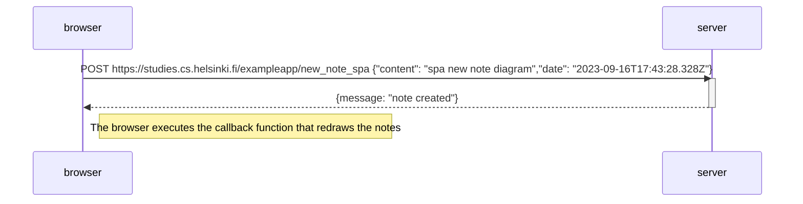

# SPA New note diagram

```mermaid
sequenceDiagram
    participant browser
    participant server

    browser->>server: POST https://studies.cs.helsinki.fi/exampleapp/new_note_spa {"content": "spa new note diagram","date": "2023-09-16T17:43:28.328Z"}
    activate server
    server-->>browser: {message: "note created"}
    deactivate server

    Note right of browser: The browser executes the callback function that redraws the notes
```
